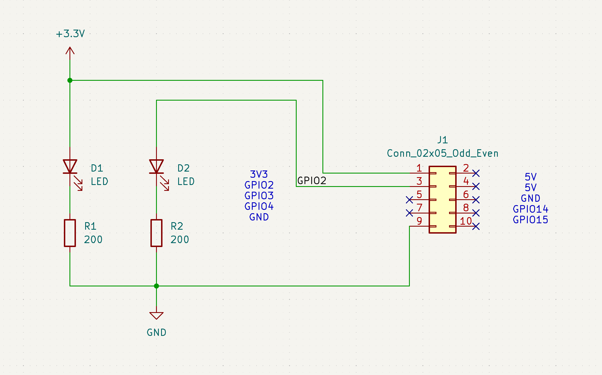
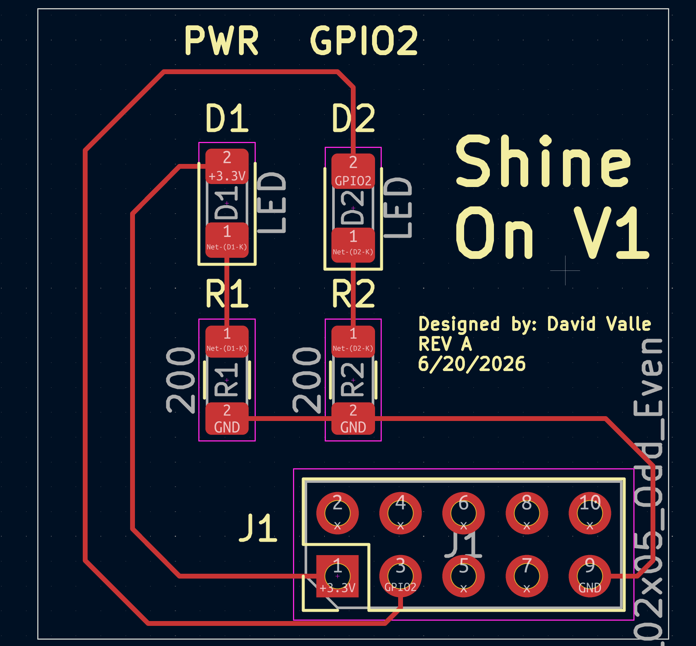
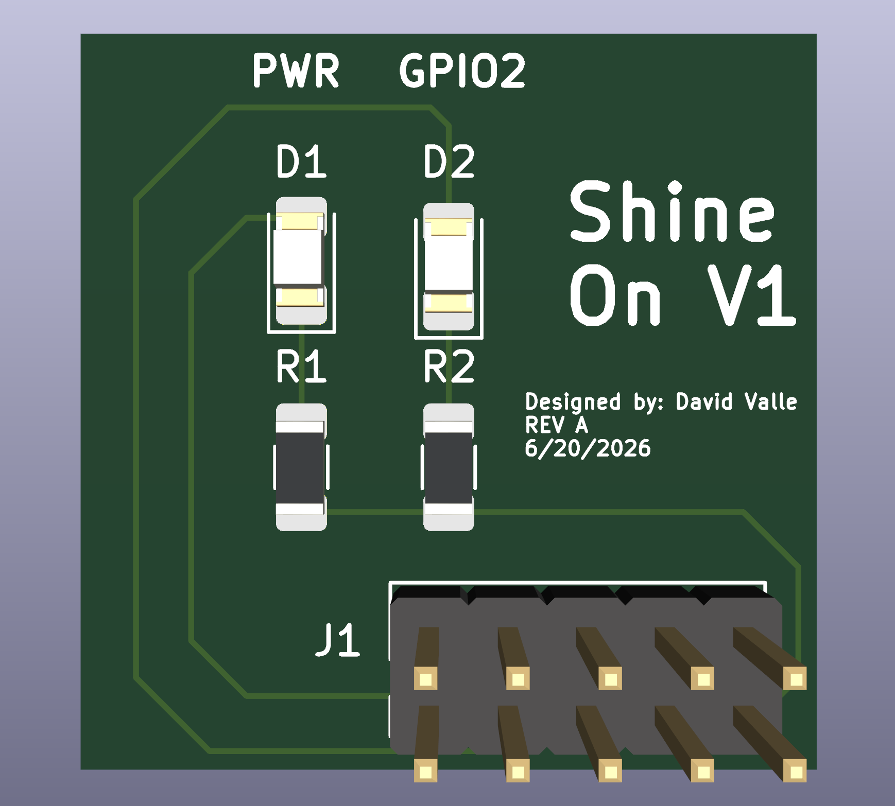
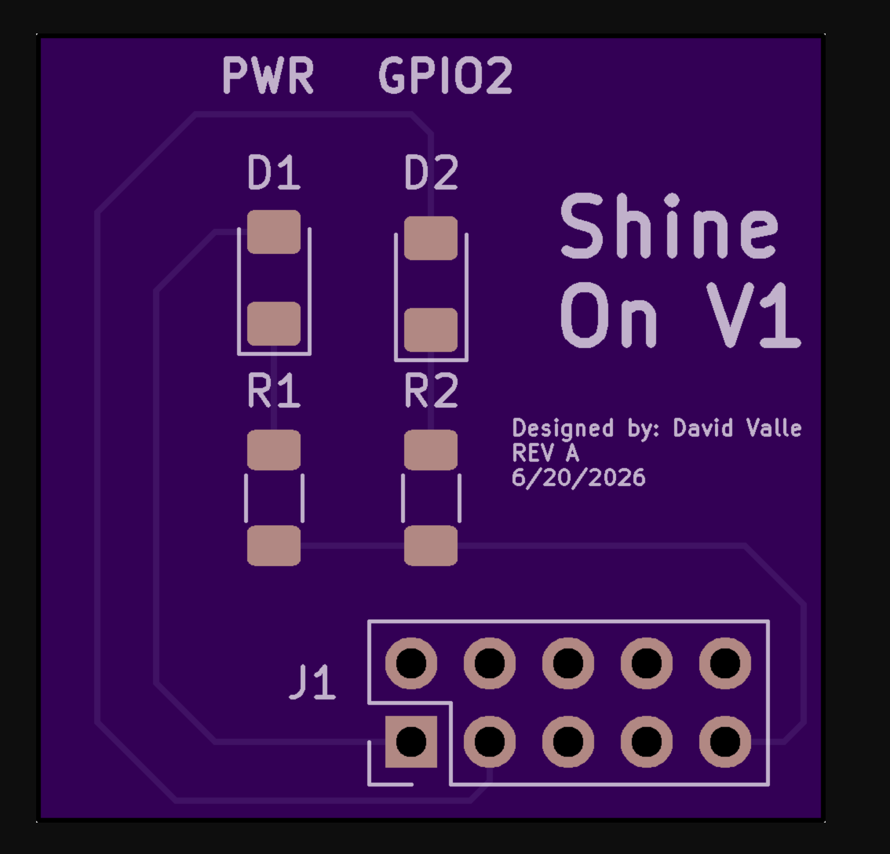
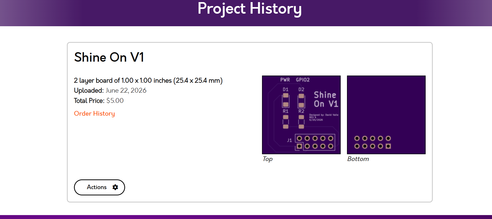

# Shine On V1

A simple 2-layer LED indicator board designed to plug into a Raspberry Pi 4 GPIO header. Built as a hands-on exercise in schematic capture, PCB layout, component selection, DFM, and hand soldering.

**Designed in:** KiCad  
**Fabricated by:** OSHPark ($5.00 for 3 boards)  
**Components sourced from:** DigiKey  
**Assembly:** Hand soldered by designer  
**Board size:** 25.4 × 25.4 mm (1.00 × 1.00 in), 2-layer

---

## Schematic



Both LEDs are driven in a simple series configuration:

- **D1:** +3.3V → D1 (LED 1206) → R1 (200 Ω) → GND
- **D2:** GPIO2 → D2 (LED 1206) → R2 (200 Ω) → GND

Current limiting resistors R1 and R2 are 200 Ω, 1/4 W rated, 1206 package. At 3.3V with a typical LED forward voltage of ~2.0V:

> I = (3.3V − 2.0V) / 200 Ω ≈ **6.5 mA**

Well within GPIO drive capability (~16 mA max) and LED ratings. Power dissipation per resistor ≈ 8.5 mW — well under the 250 mW rating.

The 10-pin dual-row header (J1) connects directly to the Raspberry Pi 4 GPIO header, exposing +3.3V, GPIO2, and GND.

---

## PCB Layout




### Design Decisions

- **1206 SMD footprints** chosen for all passives and LEDs to enable reliable hand soldering — larger pads reduce the risk of tombstoning and bridging compared to 0402/0603.
- **No copper pours** — basic 2-layer board with point-to-point trace routing. Unnecessary complexity avoided for a low-frequency, low-power design.
- **Silkscreen labels** (PWR, GPIO2) placed near each LED for immediate functional identification without referring to a schematic.
- **Board name and revision block** included in silkscreen per professional documentation practice.
- **Chamfered board corners** on the edge cuts layer.

---

## Bill of Materials

| Ref | Description | Part Number | Qty | Unit Price |
|-----|-------------|-------------|-----|------------|
| R1, R2 | RES 200 Ω 5% 1/4W 1206 | 311-200ERCT-ND (RC1206JR-07200RL) | 50 | $0.027 |
| D1, D2 | Blue LED Surface Mount 1206 | 1568-17734-ND (17734) | 10 | $0.310 |
| J1 | Female Header 2×5 2.54mm Vertical THT | 4324-FHMD-DA010G1NBON-B-ND | 10 | $0.498 |

Components ordered from DigiKey (Order #99956045), shipped 6/22/2026.

**Footprints used:**
- D1, D2: `LED_SMD:LED_1206_3216Metric_Pad1.42`
- R1, R2: `Resistor_SMD:R_1206_3216Metric_Pad1.42`
- J1: `Connector_PinHeader_2.54mm:PinHeader_2x05_P2.54mm_Vertical`

---

## Fabrication

**Fabricator:** [OSHPark](https://oshpark.com)  
**Stack-up:** 2-layer, 1 oz copper, purple solder mask, ENIG finish  
**Board cost:** $5.00 (includes 3 copies)  
**Uploaded:** June 22, 2026

OSHPark renders:




---

## Lessons Learned

- OSHPark's 1" × 1" minimum makes this an ideal low-cost prototype vehicle for simple indicator/breakout boards.
- 1206 is noticeably easier to hand solder than 0603 — pads are large enough to tin individually and place with tweezers without a hot plate.
- Silkscreen functional labels (not just reference designators) significantly improve board usability without added cost.
- Sourcing resistors in a strip of 50 and LEDs in a strip of 10 keeps unit cost negligible while building personal component inventory.

---

## Repository Structure

```
shine-on-v1/
├── kicad/              # KiCad project files (.kicad_sch, .kicad_pcb, .kicad_pro)
├── gerbers/            # Fabrication output files
├── images/             # Schematic, layout, render, and OSHPark screenshots
├── bom/                # Bill of materials (CSV or Excel)
└── README.md
```

---

## Author

**David Valle**  
Electrical Engineering, Stevens Institute of Technology  
REV A — June 20, 2026
